<div align="center">

# Threat Hunt Library

#### A living, MITRE ATT&CK-aligned catalog of threat hunts — tracked in GitHub, archived automatically.

[](https://attack.mitre.org/matrices/enterprise/)
[](.github/workflows)
[](https://nvafiades1.github.io/threat-hunt-library/)
[](https://nvafiades1.github.io/threat-hunt-library/metrics.html)

**[View the Live Threat Hunt Matrix &rarr;](https://nvafiades1.github.io/threat-hunt-library/)** &middot; **[Executive Metrics Dashboard &rarr;](https://nvafiades1.github.io/threat-hunt-library/metrics.html)**

</div>

---

## Overview

The **Threat Hunt Library** is a team-owned knowledge base of every threat hunt we run, organized by MITRE ATT&CK technique. Each hunt captures the hypothesis, the query used, what was observed, and what was concluded — so future hunts build on prior work instead of starting from scratch.

**Why it exists.** Hunt results tend to live in ticketing systems, chat threads, and personal notebooks. They decay. This repository makes every completed hunt:

- **Discoverable** &mdash; organized under `techniques/T####/` and visualized on a live MITRE matrix.
- **Auditable** &mdash; every hunt lives as both a GitHub issue (workflow) and a committed markdown file (record).
- **Reusable** &mdash; future hunts for the same technique start from prior findings.

**Who uses it.** Threat hunters, detection engineers, security leadership, and anyone preparing for an audit, purple-team exercise, or coverage review.

---

## The Workflow

```mermaid
flowchart LR
    A[Analyst opens<br/>Threat Hunt issue] --> B[Auto-added to<br/>Project Board]
    B --> C[In Progress<br/>analyst runs hunt]
    C --> D[Peer Review]
    D --> E[Status: Completed]
    E -->|automation| F[Issue closed]
    F -->|automation| G[Archived to<br/>techniques/T####/]
    G -->|automation| H[Matrix rebuilt<br/>& published]

    style A fill:#17202c,stroke:#e87722,color:#fff
    style E fill:#17202c,stroke:#2fbf71,color:#fff
    style H fill:#17202c,stroke:#2fbf71,color:#fff
```



1. **Propose.** Analyst opens a *Threat Hunt* issue using the template. Fields: MITRE Technique ID, hypothesis, query, platform, severity, confidence, observed indicators.
2. **Triage.** The new issue appears automatically on the **Threat Hunt Tracker** project board in the `Backlog` column.
3. **Execute.** Analyst moves the card to `In Progress`, runs the hunt, records findings in the issue.
4. **Review.** Move to `Peer Review`. A second analyst validates the query, findings, and fidelity.
5. **Archive.** Move the card to `Completed`. Automation takes over: the issue is closed, the hunt is written to `techniques/T####/`, and the live matrix is rebuilt.

No manual file creation, no folder navigation &mdash; the project board drives the archive.

---

## Quick Start

### For analysts (contributing a hunt)

1. Open a new issue &mdash; pick the **Threat Hunt** template.
2. Fill in every field the template asks for. **The MITRE Technique ID (e.g., `T1059.001`) is required** &mdash; automation uses it to file the hunt correctly.
3. The issue appears on the [Threat Hunt Tracker](https://github.com/users/Nvafiades1/projects/3) board. Move it through `Backlog` &rarr; `Ready` &rarr; `In Progress` &rarr; `Peer Review` &rarr; `Completed`.
4. Done. The archive happens for you.

### For reviewers

- The project board is the single source of truth for *what's in flight*.
- The `techniques/` folder is the single source of truth for *what's completed*.
- The [Live Matrix](https://nvafiades1.github.io/threat-hunt-library/) gives a bird's-eye coverage view across all 14 ATT&CK tactics.

### For executives / audit

- **[Metrics Dashboard](https://nvafiades1.github.io/threat-hunt-library/metrics.html)** shows total hunts, techniques covered, threat actors tracked, coverage %, and trend charts over time.
- Coverage percentage is also shown in the header of the live matrix.
- Every completed hunt is committed and timestamped &mdash; suitable for audit evidence.
- The project board shows throughput and current work in one glance.

---

## Repository Layout

```
threat-hunt-library/
├── README.md                     ← you are here
├── docs/
│   ├── index.html                ← the live matrix (auto-generated)
│   └── metrics.html              ← executive metrics dashboard (auto-generated)
├── techniques/
│   ├── T1003/                    ← OS Credential Dumping
│   │   ├── README.md             ← MITRE description (auto-updated)
│   │   └── T1003-*.md            ← individual hunts (one per issue)
│   ├── T1059/                    ← Command and Scripting Interpreter
│   └── ... (836 technique folders, full enterprise coverage)
├── mitre_ttp_mapping.json        ← technique → tactic mapping
├── tools/
│   ├── build_matrix.py           ← generates docs/index.html
│   └── build_metrics.py          ← generates docs/metrics.html
└── .github/
    ├── ISSUE_TEMPLATE/           ← threat-hunt form template
    ├── scripts/
    │   ├── createMitreFolders.js ← keeps techniques/ in sync with ATT&CK
    │   └── updateThreatHunt.js   ← archives completed hunts
    └── workflows/                ← four automation pipelines (see below)
```

---

## Automation

Four workflows keep the library self-maintaining:

| Workflow | Trigger | What it does |
|---|---|---|
| **Update MITRE Folders** | Weekly cron + pushes | Pulls the latest ATT&CK data and creates/updates a folder + README per technique. |
| **Save New Issue to Folder** | Issue opened | Stages the new issue as `test/issue-<N>.md` for audit trail. |
| **Update Threat Hunt** | Issue closed | Reads the MITRE T# from the issue, writes the completed hunt into `techniques/T####/`. |
| **Build MITRE Matrix** | Push to main | Regenerates `docs/index.html` from the current `techniques/` tree; GitHub Pages redeploys automatically. |

All workflows authenticate via the built-in `GITHUB_TOKEN` with explicit `permissions:` blocks &mdash; no personal access tokens to manage.

---

## The Live Matrix

The matrix at **https://nvafiades1.github.io/threat-hunt-library/** mirrors the MITRE ATT&CK Enterprise layout:

- **Columns** are tactics (Reconnaissance &rarr; Impact).
- **Cards** are techniques; click any card to jump to the technique's folder.
- **Green dot + left border** marks techniques with at least one completed hunt.
- **Expand** parent techniques to see sub-techniques.
- **Search** (`/`) filters in real time; **Esc** clears.
- **Click a tactic header** to dim other columns.
- **Alt+D** toggles light/dark theme.

The header shows a live coverage percentage. As hunts complete and land in `techniques/`, this number climbs automatically on the next push.

---

## Customizing

### Change the matrix look

Edit `tools/build_matrix.py` &mdash; the HTML template and CSS live in that single file. Pushing to `main` rebuilds and redeploys automatically.

### Add / rename a tactic

The `TACTICS` list in `tools/build_matrix.py` drives column order. The `mitre_ttp_mapping.json` file maps each T#### to its tactic.

### Tune the archive format

The markdown written to `techniques/T####/` is formatted in `.github/scripts/updateThreatHunt.js` (see the `content = [...]` block in `run()`).

---

## Maintainer

Issues, feature requests, and questions &rarr; [open an issue](https://github.com/Nvafiades1/threat-hunt-library/issues/new/choose).

<div align="center">
<sub>Built with GitHub Issues, Projects, and Actions. Aligned with MITRE ATT&amp;CK Enterprise.</sub>
</div>
