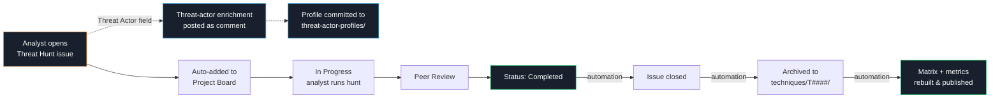
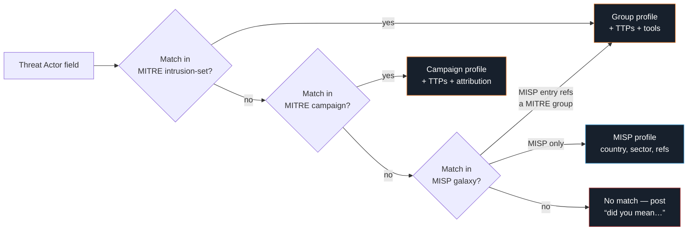

<div align="center">

# Threat Hunt Library

#### A living, MITRE ATT&CK-aligned catalog of threat hunts — tracked in GitHub, archived automatically.

[](https://attack.mitre.org/matrices/enterprise/)
[](.github/workflows)
[](https://nvafiades1.github.io/threat-hunt-library/)
[](https://nvafiades1.github.io/threat-hunt-library/metrics.html)
[](https://nvafiades1.github.io/threat-hunt-library/cti.html)

**[Live Threat Hunt Matrix &rarr;](https://nvafiades1.github.io/threat-hunt-library/)** &middot; **[Executive Metrics Dashboard &rarr;](https://nvafiades1.github.io/threat-hunt-library/metrics.html)** &middot; **[CTI Hub &rarr;](https://nvafiades1.github.io/threat-hunt-library/cti.html)**

</div>

---

## Overview

The **Threat Hunt Library** is a team-owned knowledge base of every threat hunt we run, organized by MITRE ATT&CK technique. Each hunt captures the hypothesis, the query used, what was observed, and what was concluded — so future hunts build on prior work instead of starting from scratch.

**Why it exists.** Hunt results tend to live in ticketing systems, chat threads, and personal notebooks. They decay. This repository makes every completed hunt:

- **Discoverable** &mdash; organized under `techniques/T####/` and visualized on a live MITRE matrix.
- **Auditable** &mdash; every hunt lives as both a GitHub issue (workflow) and a committed markdown file (record).
- **Reusable** &mdash; future hunts for the same technique start from prior findings.

**Who uses it.** Threat hunters, detection engineers, security leadership, and anyone preparing for an audit, purple-team exercise, or coverage review.

---

## The Workflow



1. **Propose.** Analyst opens a *Threat Hunt* issue using the template. Fields: MITRE Technique ID, hypothesis, query, platform, severity, confidence, observed indicators.
2. **Triage.** The new issue appears automatically on the **Threat Hunt Tracker** project board in the `Backlog` column.
3. **Execute.** Analyst moves the card to `In Progress`, runs the hunt, records findings in the issue.
4. **Review.** Move to `Peer Review`. A second analyst validates the query, findings, and fidelity.
5. **Archive.** Move the card to `Completed`. Automation takes over: the issue is closed, the hunt is written to `techniques/T####/`, and the live matrix is rebuilt.

No manual file creation, no folder navigation &mdash; the project board drives the archive.

---

## Quick Start

### For analysts (contributing a hunt)

1. Open a new issue &mdash; pick the **Threat Hunt** template.
2. Fill in every field the template asks for. **The MITRE Technique ID (e.g., `T1059.001`) is required** &mdash; automation uses it to file the hunt correctly.
3. The issue appears on the [Threat Hunt Tracker](https://github.com/users/Nvafiades1/projects/3) board. Move it through `Backlog` &rarr; `Ready` &rarr; `In Progress` &rarr; `Peer Review` &rarr; `Completed`.
4. Done. The archive happens for you.

### For reviewers

- The project board is the single source of truth for *what's in flight*.
- The `techniques/` folder is the single source of truth for *what's completed*.
- The [Live Matrix](https://nvafiades1.github.io/threat-hunt-library/) gives a bird's-eye coverage view across all 14 ATT&CK tactics.

### For executives / audit

- **[Metrics Dashboard](https://nvafiades1.github.io/threat-hunt-library/metrics.html)** shows total hunts, techniques covered, threat actors tracked, coverage %, and trend charts over time.
- Coverage percentage is also shown in the header of the live matrix.
- Every completed hunt is committed and timestamped &mdash; suitable for audit evidence.
- The project board shows throughput and current work in one glance.

---

## Repository Layout

```
threat-hunt-library/
├── README.md                     ← you are here
├── docs/
│   ├── index.html                ← the live matrix (auto-generated)
│   ├── metrics.html              ← executive metrics dashboard (auto-generated)
│   └── cti.html                  ← CTI hub: aggregated open-source threat intel (auto-generated, hourly)
├── techniques/
│   ├── T1003/                    ← OS Credential Dumping
│   │   ├── README.md             ← MITRE description (auto-updated)
│   │   └── T1003-*.md            ← individual hunts (one per issue)
│   ├── T1059/                    ← Command and Scripting Interpreter
│   └── ... (836 technique folders, full enterprise coverage)
├── threat-actor-profiles/
│   ├── G0016-apt29.md            ← MITRE ATT&CK group profiles
│   └── ...                       ← auto-generated when an issue names an actor
├── mitre_ttp_mapping.json        ← technique → tactic mapping
├── tools/
│   ├── build_matrix.py           ← generates docs/index.html
│   ├── build_metrics.py          ← generates docs/metrics.html
│   ├── build_cti.py              ← generates docs/cti.html (open-source CTI aggregator)
│   └── cti_state.json            ← rolling 30-day CTI item state (auto-maintained)
└── .github/
    ├── ISSUE_TEMPLATE/           ← threat-hunt form template
    ├── scripts/
    │   ├── createMitreFolders.js ← keeps techniques/ in sync with ATT&CK
    │   ├── enrichThreatActor.js  ← MITRE + MISP threat-actor lookup
    │   └── updateThreatHunt.js   ← archives completed hunts
    └── workflows/                ← five automation pipelines (see below)
```

---

## Automation

Six workflows keep the library self-maintaining:

| Workflow | Trigger | What it does |
|---|---|---|
| **Update MITRE Folders** | Weekly cron + manual | Pulls the current STIX bundle from `mitre-attack/attack-stix-data`, regenerates `techniques/T####/README.md` for every active + deprecated + revoked technique, and rewrites `mitre_ttp_mapping.json`. Deprecated/revoked techniques get a `STATUS:` callout in their README. |
| **Save New Issue to Folder** | Issue opened | Stages the new issue as `test/issue-<N>.md` for audit trail. |
| **Enrich Threat Actor** | Issue opened / edited | Looks up the named actor or campaign across **MITRE ATT&CK groups, MITRE ATT&CK campaigns, and the MISP threat-actor galaxy**. Commits a full profile to `threat-actor-profiles/` and posts (or updates in place) a summary comment with TTPs, tools, and a link to the profile. See [Threat Actor Enrichment](#threat-actor-enrichment) below. |
| **Update Threat Hunt** | Issue closed | Reads the MITRE T# from the issue, writes the completed hunt into `techniques/T####/`. |
| **Build MITRE Matrix** | Push to main &middot; after hunt close &middot; after MITRE sync | Regenerates `docs/index.html` and `docs/metrics.html` from the current `techniques/` tree; GitHub Pages redeploys automatically. |
| **Build CTI Hub** | Hourly cron + manual | Fetches 20 open-source threat-intel feeds (RSS / JSON / CSV), normalizes them, merges into a rolling 30-day window, and rebuilds `docs/cti.html`. See [The CTI Hub](#the-cti-hub) below. |

All workflows authenticate via the built-in `GITHUB_TOKEN` with explicit `permissions:` blocks &mdash; no personal access tokens to manage.

---

## The Live Matrix

The matrix at **https://nvafiades1.github.io/threat-hunt-library/** mirrors the MITRE ATT&CK Enterprise layout:

- **Columns** are tactics (Reconnaissance &rarr; Impact).
- **Cards** are techniques; click any card to jump to the technique's folder.
- **Green dot + left border** marks techniques with at least one completed hunt.
- **Expand** parent techniques to see sub-techniques.
- **Search** (`/`) filters in real time; **Esc** clears.
- **Click a tactic header** to dim other columns.
- **Alt+D** toggles light/dark theme.

The header shows a live coverage percentage. As hunts complete and land in `techniques/`, this number climbs automatically on the next push.

---

## The CTI Hub

The hub at **https://nvafiades1.github.io/threat-hunt-library/cti.html** aggregates 20 open-source threat-intelligence feeds into a single searchable dashboard, refreshed hourly by GitHub Actions. No API keys are required &mdash; every source is a public RSS, JSON, or CSV feed.

### Sources

| Category | Sources |
|---|---|
| **Vendor research** | CrowdStrike, Microsoft Security Blog, Cisco Talos, Unit 42 (Palo Alto), SentinelOne Labs, Trend Micro Research, Securelist (Kaspersky), ESET WeLiveSecurity |
| **News & industry** | BleepingComputer, The Record, Krebs on Security, The Hacker News, Dark Reading, SecurityWeek |
| **Government** | CISA Advisories, NCSC-UK |
| **Vulnerabilities** | CISA Known Exploited Vulnerabilities (KEV) catalog |
| **IOCs** | abuse.ch URLhaus, abuse.ch MalwareBazaar, abuse.ch ThreatFox |

### Page features

- **Stats header** &mdash; total items, last 24h, last 7d, new this build, sources online.
- **Category tabs** &mdash; All / Vendor research / News / Government / Vulnerabilities / IOCs.
- **Filters** &mdash; per-source dropdown, time range (24h / 7d / 30d), free-text search across title, summary, and tags.
- **NEW badges** &mdash; items first seen in the most recent build are flagged.
- **Link-out only** &mdash; the hub never re-hosts source content; titles link directly to the publisher.
- **Dark / light theme** with persistence.

### How it works

Every hour at `:15`, `tools/build_cti.py` fetches all 20 sources in parallel (10 worker threads, ~25s timeout per source), normalizes everything to a common schema, and merges new items into a rolling 30-day window kept in `tools/cti_state.json`. The merged set is rendered into a single self-contained `docs/cti.html` file (no external assets, no JS frameworks). Any individual source failure is logged and skipped &mdash; the build succeeds as long as at least one source returns data.

---

## Threat Actor Enrichment

When you open or edit a Threat Hunt issue and fill in the **Threat Actor** field, the `Enrich Threat Actor` workflow looks the value up across three sources, builds a profile, and posts a summary comment back on the issue.

### Resolution order



### What gets recognised

| Naming family | Example | Resolved how |
|---|---|---|
| MITRE primary | `APT29`, `FIN7`, `Lazarus Group` | MITRE group (G####) |
| MITRE alias | `Cozy Bear`, `Midnight Blizzard`, `UNC2452` | MITRE group via alias list |
| Microsoft codes (modern) | `Storm-0249`, `Mint Sandstorm` | MISP &rarr; MITRE if linked, else MISP-only profile |
| Mandiant / CrowdStrike codes | `UNC4990`, `WIZARD SPIDER` | MISP coverage; resolves to MITRE when the MISP entry references one |
| MITRE campaign | `SolarWinds Compromise`, `2015 Ukraine Electric Power Attack` | MITRE campaign (C####) with `attributed-to` actor link |

### What lands where

| Output | Content |
|---|---|
| `threat-actor-profiles/G####-{slug}.md` | Full MITRE group profile: snapshot block (country, suspected sponsor, target sectors, suspected victims, most-recent campaign, coverage stats), overview, **Attributed Campaigns table** with first/last seen dates, tools/malware with platforms, **per-TTP procedure descriptions** (the "how" — quoted from MITRE for hunters to use as query starting points), **Recommended Mitigations** as a hardening checklist, and a **References & IOC Sources** section listing every primary research report MITRE cites (Volexity, Mandiant, FireEye, CrowdStrike, Microsoft, NCSC, etc.). |
| `threat-actor-profiles/C####-{slug}.md` | Full MITRE campaign profile: snapshot, attributed-to actor link, dates, tools, per-TTP procedure descriptions, mitigations, references. |
| `threat-actor-profiles/misp-{slug}.md` | MISP-only fallback profile: aliases, country, sponsor, target sectors, suspected victims, motive, MISP-cited IOC source URLs. (No TTPs &mdash; MITRE doesn't track this actor.) |
| Comment on issue | One section per match with aliases, country/sponsor/sectors line, most-recent-campaign line, description excerpt, headline counts (`66 TTPs · 12 tactics · 49 tools · 2 campaigns`), and a link to the full profile. Multiple comma-separated actors get one comment with multiple sections. |

### Smart re-enrichment

Each enrichment comment carries a hidden marker tagging the canonical IDs it covers (e.g. `<!-- threat-actor-enrichment:v2 ids=G0016,C0024 -->`). On a subsequent issue edit:

- **Same actor list** &rarr; workflow exits without acting (no spam comments).
- **Actor list changed** &rarr; the existing comment is **edited in place** to reflect the new resolution; new profile files are committed alongside the old ones (history is preserved &mdash; nothing is deleted).
- **No-match retry** &rarr; if the analyst fixes a typo, the next edit picks up the corrected name and rewrites the comment accordingly.

---

## Customizing

### Change the matrix look

Edit `tools/build_matrix.py` &mdash; the HTML template and CSS live in that single file. Pushing to `main` rebuilds and redeploys automatically.

### Add / rename a tactic

The `TACTICS` list in `tools/build_matrix.py` drives column order. The `mitre_ttp_mapping.json` file maps each T#### to its tactic.

### Tune the archive format

The markdown written to `techniques/T####/` is built in `.github/scripts/updateThreatHunt.js` (see `buildArchive()`).

### Tune the threat-actor enrichment

The MISP and MITRE STIX URLs, the resolution priority, and the profile/comment markdown templates live in `.github/scripts/enrichThreatActor.js`. To extend coverage to additional sources (e.g., MITRE ATT&CK Mobile, MITRE ICS), add a new fetcher and a new branch in `resolveQuery()`.

### Tune the CTI feed sources

The full source list, fetcher dispatch table, and HTML/CSS template all live in `tools/build_cti.py`. To add a feed, append a tuple to `SOURCES` (`(display_name, category, fetcher_key, url)`) &mdash; for an RSS source the existing `fetch_rss` handler is enough. For a non-RSS format (JSON / CSV), add a new fetcher function and register it in `FETCHERS`. Refresh cadence is set in `.github/workflows/build_cti.yml` (default: hourly at `:15`).

---

## Maintainer

Issues, feature requests, and questions &rarr; [open an issue](https://github.com/Nvafiades1/threat-hunt-library/issues/new/choose).

<div align="center">
<sub>Built with GitHub Issues, Projects, and Actions. Aligned with MITRE ATT&amp;CK Enterprise.</sub>
</div>
