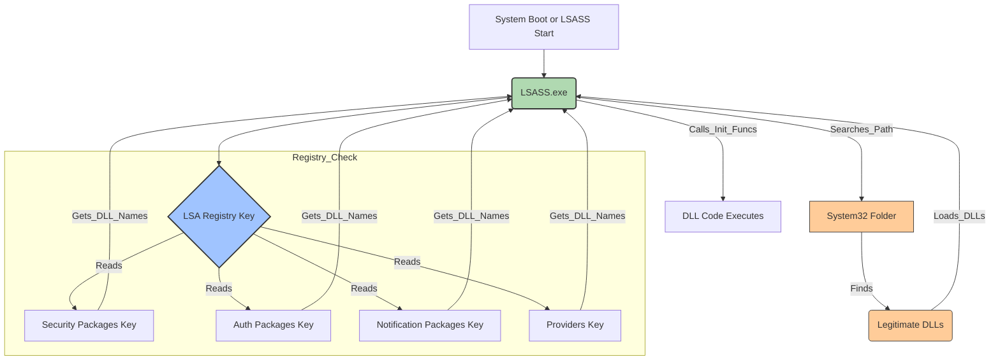
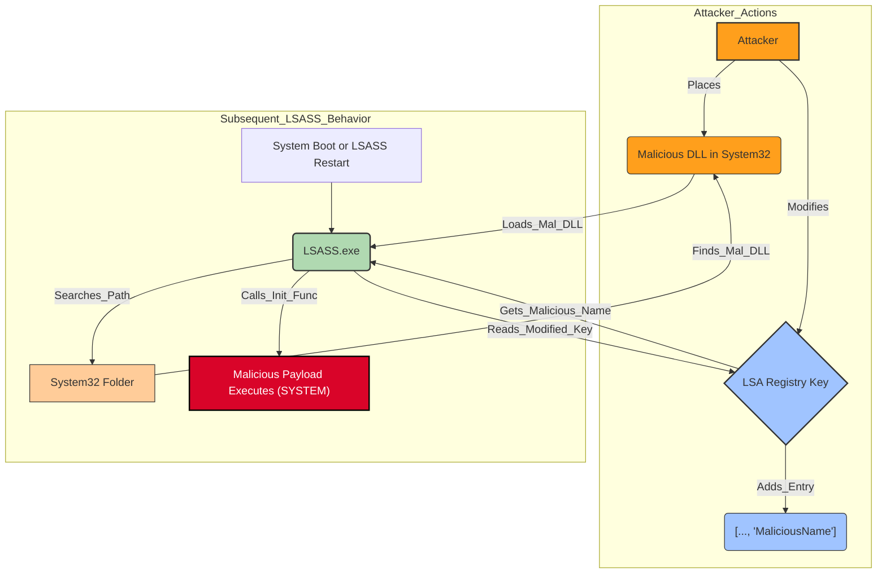
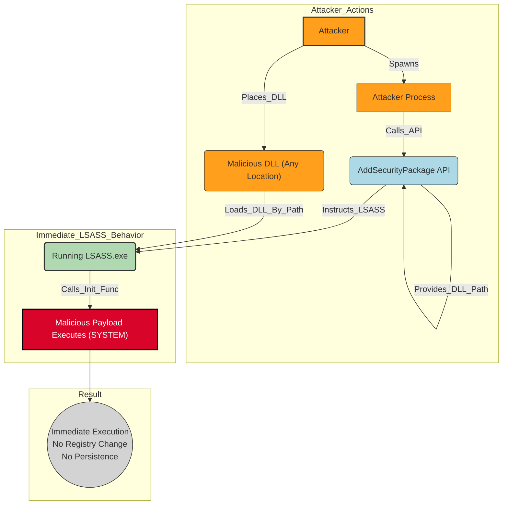

# TRR0019: Persistence via Security Support Provider Registration

## Metadata

| Key               | Value                                                              |
|-------------------|--------------------------------------------------------------------|
| **ID**            | TRR0019                                                            |
| **External IDs**  | T1547.005 |
| **Tactics**       | Persistence, Privilege Escalation, Credential Access |
| **Platforms**     | Windows                                                            |
| **Contributors**  | Nick Vafiades                                  |

## Scoping Statement

This Threat Research Report (TRR) focuses specifically on the adversary tactic of achieving persistence, privilege escalation, and credential access by registering malicious Dynamic Link Libraries (DLLs) as Security Support Providers (SSPs) or related LSA packages (Authentication Packages, Notification Packages, Providers) within the Windows operating system. It details the mechanisms involving registry manipulation under `HKLM\SYSTEM\CurrentControlSet\Control\Lsa` and the subsequent loading of these DLLs into the highly privileged `lsass.exe` process. This TRR also covers variations such as dynamic loading via API calls for non-persistent execution. It explicitly excludes other methods of interacting with LSASS, such as direct memory dumping (T1003.001), general process injection techniques (T1055), or exploiting specific LSASS vulnerabilities. The procedures outlined aim to cover the known distinct methods adversaries use to abuse this specific LSA package loading functionality.

## Technique Overview

Adversaries may gain persistent code execution and facilitate credential access by registering a malicious Dynamic Link Library (DLL) within the Local Security Authority Subsystem Service (LSASS) process (`lsass.exe`). This technique leverages the legitimate Windows mechanism for loading Security Support Providers (SSPs) and related authentication or notification packages. By modifying specific multi-string values within the `HKEY_LOCAL_MACHINE\SYSTEM\CurrentControlSet\Control\Lsa` registry key, adversaries instruct LSASS to load their custom DLL during system initialization, typically at boot time. The primary goals are achieving persistence, as the DLL is loaded automatically on each startup; gaining privileged execution context, since LSASS runs as SYSTEM; and accessing sensitive credential material. Once loaded inside LSASS, the malicious DLL can intercept authentication events, harvest credentials like NTLM hashes, Kerberos tickets, or potentially plaintext passwords, and exfiltrate this data. Successfully executing this technique requires elevated privileges (Administrator or SYSTEM) to modify the protected LSA registry keys and typically to place the malicious DLL, which must implement expected export functions, into a trusted system directory like `System32`. Variations exist where adversaries target different registry keys (like `Authentication Packages` or `Notification Packages`) or utilize dynamic API calls such as `AddSecurityPackage` for immediate, non-persistent loading without registry changes.

## Technical Background

The Local Security Authority Subsystem Service (`lsass.exe`) serves as the central hub for security operations on a Windows system. Running as the highly privileged `SYSTEM` account, it manages critical functions including user authentication (validating credentials for interactive logons, network access, service startups), enforcement of security policies (like password complexity and account lockouts), creation and management of access tokens that define user privileges, and secure storage of sensitive system secrets. Due to its access to credential data (hashes, Kerberos tickets, potentially plaintext passwords under certain configurations) and its high privilege level, `lsass.exe` is a primary target for adversaries seeking credential access and privileged code execution. Modern Windows versions implement defenses like LSA Protection (configured as a Protected Process Light - PPL), which aims to prevent non-trusted processes from accessing LSASS memory or injecting code, making techniques that leverage legitimate loading mechanisms like SSP registration more attractive to attackers.

Windows utilizes a flexible, extensible architecture for handling diverse authentication protocols and security mechanisms, relying on Dynamic Link Libraries (DLLs) loaded into LSASS. Key types of these pluggable modules include Security Support Providers (SSPs), which implement specific security protocols like Kerberos (`kerberos.dll`), NTLM (`msv1_0.dll`), or TLS/SSL (`schannel.dll`), exposing functionality through the standard Security Support Provider Interface (SSPI). Authentication Packages (APs), such as `msv1_0.dll`, are responsible for verifying user credentials during logon events. Notification Packages (like `scecli.dll`) can register to receive callbacks from LSA upon specific events, most notably password changes (`PasswordChangeNotify`). Additionally, a less commonly utilized `Providers` key exists for loading other types of LSA-integrated DLLs. This modular design, while flexible, creates an opportunity for adversaries: if they can trick LSASS into loading a malicious DLL masquerading as one of these legitimate package types, they gain privileged execution within the core security process.

The mechanism by which LSASS loads these packages relies heavily on the Windows Registry. During its initialization phase (primarily at system boot, or rarely if the service restarts), LSASS queries specific values located under the `HKEY_LOCAL_MACHINE\SYSTEM\CurrentControlSet\Control\Lsa` registry key. The crucial values – `Security Packages`, `Authentication Packages`, `Notification Packages`, and `Providers` – are of the `REG_MULTI_SZ` data type. This type stores a sequence of null-terminated strings, itself terminated by an additional null character, effectively representing a list. LSASS reads these lists, extracting the base names (e.g., `kerberos`, `msv1_0`, `my_evil_ssp`) of the DLLs to be loaded. Because full paths are not typically stored here, LSASS then relies on the standard Windows DLL search order to resolve each base name to a full file path. This search order prioritizes known system directories, with `%SystemRoot%\System32` being a primary location searched early on (and `%SystemRoot%\SysWOW64` for 32-bit processes on 64-bit systems, although `lsass.exe` itself is typically 64-bit on modern OSes). Once LSASS locates the corresponding DLL file, it uses Windows loader functions (conceptually similar to `LoadLibraryW`, implemented via lower-level NTDLL functions like `LdrLoadDll`) to map the DLL into its own process address space. Following successful loading, LSASS calls specific initialization functions exported by the DLL, such as `SpLsaModeInitialize` for SSPs, `LsaApInitializePackage` for APs, or `InitializeChangeNotify` for notification packages. This initialization call triggers the execution of the code within the DLL, including any malicious payload implanted by the adversary.

 > **Figure 1: Legitimate LSA Package Loading Process at Boot**

> **Figure 2: Malicious DLL Loading for Persistence (Registry Method)**

Modifying the sensitive LSA registry keys under `HKLM\SYSTEM\CurrentControlSet\Control\Lsa` requires elevated privileges, typically Administrator or SYSTEM, due to the default restrictive Access Control Lists (ACLs) protecting them. Similarly, writing the malicious DLL to the standard target location, `%SystemRoot%\System32`, usually demands the same level of privilege. Adversaries must overcome these permission hurdles, often after initially compromising an administrative account or escalating privileges through other means.

Once an adversary successfully registers and loads their malicious DLL into `lsass.exe`, the consequences are severe. The malicious code executes with the full rights of the `SYSTEM` account. It has intimate access to LSASS's internal memory space and functions. This allows for various malicious activities: implementing hooks (e.g., via inline function patching or Import Address Table modification) on authentication functions like `LsaLogonUser` or `Msv1_0SubAuthenticationRoutine` to intercept credentials in transit; directly scraping LSASS memory for stored credential material (targeting known structures like `KIWI_LOGON_SESSION` or `MSV1_0_PRIMARY_CREDENTIAL` containing hashes, tickets, or plaintext passwords if WDigest is enabled); potentially manipulating access tokens or security contexts; or simply using the trusted, highly privileged LSASS process as a stealthy platform for executing other commands, interacting with Command and Control (C2) servers, or facilitating lateral movement.

Distinct from the registry-based persistence methods, Windows also provides the `AddSecurityPackage` API (exported by `Secur32.dll`). This function allows a sufficiently privileged process (Administrator/SYSTEM) to dynamically instruct a *running* LSASS instance to load a specified SSP DLL immediately, using its full path. This provides instantaneous code execution within LSASS but does *not* involve registry modification and therefore does not persist across system reboots or LSASS restarts, making it primarily a technique for immediate credential access or temporary privileged execution rather than long-term persistence.

> **Figure 3: Malicious DLL Loading for Immediate Execution (API Method)**

## Procedures

The following procedures detail methods adversaries use to register and load malicious DLLs into the LSASS process. Procedure A is the most classic example targeting `Security Packages`.

| ID                 | Title                                                   | Key Mechanism                                     | Persistence     |
| :----------------- | :------------------------------------------------------ | :------------------------------------------------ | :-------------- |
| **TRR0019.WIN.A**  | Register via Security/Authentication Packages         | Registry Mod (`Security Packages` / `Auth Packages`) | Yes (Reboot)    |
| **TRR0019.WIN.B**  | Register via Notification Packages                    | Registry Mod (`Notification Packages`)            | Yes (Reboot)    |
| **TRR0019.WIN.C**  | Register via Providers Key                            | Registry Mod (`Providers`)                        | Yes (Reboot)    |
| **TRR0019.WIN.D**  | Dynamic Load after Registry Modification              | Registry Mod + Forced Load (No Reboot)            | Yes (Reboot)    |
| **TRR0019.WIN.E**  | Dynamic Load via AddSecurityPackage API               | API Call (`AddSecurityPackage`)                   | No              |

### Procedure A: Register via Security/Authentication Packages

*   **ID**: TRR0019.WIN.A
*   **Description**: This procedure represents the canonical method for SSP hijacking, targeting the primary registry values LSASS checks for loading security and authentication modules. It establishes persistent execution within LSASS upon system reboot.
    *   **Prepare Malicious DLL:** An adversary crafts or obtains a DLL file engineered to impersonate a legitimate SSP or Authentication Package. This involves implementing specific exported functions that LSASS expects to call during initialization and operation, such as `SpLsaModeInitialize` for SSPs or `LsaApInitializePackage` for APs. The DLL must match the architecture (x64/x86) of the target `lsass.exe`. The *implementation* of the malicious payload within these functions (or `DllMain`) can vary widely: it might hook APIs using techniques like inline patching or IAT modification, perform memory scraping for credential structures (e.g., searching for `KIWI_LOGON_SESSION` patterns popularized by Mimikatz), log credentials to a file (perhaps encoded or encrypted), exfiltrate data via network channels (DNS, HTTP/S, custom protocols), or act as a simple loader/beacon for more complex implants. The DLL itself could be written in various languages (C, C++, Delphi, Rust) and may employ anti-analysis techniques like packing, encryption, or obfuscation.
    *   **Place DLL in Trusted Location:** The compiled malicious DLL must be placed where LSASS can find it using the standard DLL search path. `%SystemRoot%\System32` is the most common target location, ensuring the DLL is found reliably and potentially helps it blend in. Placing a file here requires Administrator or SYSTEM privileges. Adversaries might use a variety of tools or methods for the transfer: basic command-line utilities (`copy`, `move`, `xcopy`, `robocopy`), scripting languages (PowerShell's `Copy-Item`), Living-off-the-Land Binaries (LOLBAS) capable of file transfer/writing (`certutil -decode`, `bitsadmin`), or direct Win32 API calls (`CreateFileW`, `WriteFile`, `CopyFileW`) from within malware or tools. Evasion techniques like dropping the DLL encoded/encrypted and decoding it on disk, or timestomping the DLL's timestamps to match legitimate system files, might also be employed.
    *   **Modify LSA Registry Key:** With Administrator/SYSTEM privileges, the adversary targets `HKEY_LOCAL_MACHINE\SYSTEM\CurrentControlSet\Control\Lsa\Security Packages` or `HKEY_LOCAL_MACHINE\SYSTEM\CurrentControlSet\Control\Lsa\Authentication Packages`. These are `REG_MULTI_SZ` values. Modification can be achieved through various means: manually via `regedit.exe`, programmatically via Win32 Registry APIs (`RegOpenKeyExW`, `RegQueryValueExW`, `RegSetValueExW` - requiring careful handling of the multi-string buffer), command-line `reg.exe` (though handling multi-string values can be tricky), PowerShell cmdlets (`Get-ItemProperty`, `Set-ItemProperty`), WMI methods (e.g., via the `StdRegProv` class using `wmic` or PowerShell), or COM objects. The core action is appending the *base name* of the malicious DLL (e.g., `ssp_evil`) to the existing list while preserving legitimate entries and the correct multi-string format. Commands or scripts performing this might be obfuscated (e.g., Base64 encoded). In rare, highly privileged scenarios (like kernel access), direct modification of the registry hive file or in-memory structures could occur, bypassing standard APIs.
    *   **Activation upon Reboot/Restart:** Once the DLL is placed and the registry modified, persistence is established. The malicious code executes when LSASS initializes during the next system boot or service restart. LSASS reads the updated package list, finds the malicious entry, uses the standard search path to locate the DLL in `System32`, loads it into its memory space, and calls its initialization export (e.g., `SpLsaModeInitialize`). This action triggers the adversary's payload within the `SYSTEM` context of LSASS.
*   **Key Artifacts / Observables**:
    *   Creation/modification of a DLL file within `%SystemRoot%\System32` or `%SystemRoot%\SysWOW64`, potentially with suspicious names, metadata, or low prevalence.
    *   Registry value write event targeting `HKLM\SYSTEM\CurrentControlSet\Control\Lsa\Security Packages` or `Authentication Packages`, specifically showing the addition of a new string.
    *   Post-reboot, module load events (e.g., Sysmon Event ID 7) showing the malicious DLL being loaded by the `lsass.exe` process.
    *   Execution of registry editing tools (`reg.exe`, `regedit.exe`, PowerShell registry cmdlets, `wmic`), potentially with obfuscated commands, targeting these specific LSA keys. API monitoring might reveal direct calls to `RegSetValueExW`.

### Procedure B: Register via Notification Packages

*   **ID**: TRR0019.WIN.B
*   **Description**: This procedure exploits the LSA mechanism for notifying registered packages about specific security-related events, primarily password changes. By inserting a malicious DLL into this notification chain, adversaries can gain targeted code execution inside LSASS precisely when credentials are being modified or validated in certain ways.
    *   **Prepare Malicious DLL:** The adversary crafts a DLL (e.g., `notify_evil.dll`) that exports functions required by the LSA Notification Package interface, notably `InitializeChangeNotify`, `PasswordChangeNotify`, and potentially `PasswordFilter` (used during password set/change validation). The malicious logic is typically placed within `PasswordChangeNotify`. When invoked, this function receives parameters including the username and potentially the new password hashes (or even plaintext under certain legacy conditions or specific hooks). The adversary's code can log this information to a file, send it over the network, or use it for other purposes. The implementation specifics of the payload (logging, exfiltration, etc.) can vary as described in Procedure A.
    *   **Place DLL in Trusted Location:** The DLL is copied to `%SystemRoot%\System32` using elevated privileges and standard file transfer methods (command-line tools, APIs, LOLBAS) as outlined in Procedure A.
    *   **Modify LSA Registry Key:** Using Administrator/SYSTEM privileges, the adversary appends the base name of their malicious DLL (e.g., `notify_evil`) to the `REG_MULTI_SZ` value `Notification Packages` at `HKEY_LOCAL_MACHINE\SYSTEM\CurrentControlSet\Control\Lsa`. This modification can be done using various registry editing tools, scripts (PowerShell, WMI), or direct API calls, similar to Procedure A. The default `scecli` entry must be preserved.
    *   **Activation upon Reboot/Event:** After the next system reboot or LSASS restart, LSASS loads all DLLs listed in `Notification Packages` and calls their `InitializeChangeNotify` function. The malicious code doesn't necessarily run continuously but is triggered whenever an event occurs for which it's registered, such as a local or domain password change processed by the machine. When a password change happens, LSASS invokes the `PasswordChangeNotify` export in the malicious DLL, providing the adversary with timely access to credential data within the LSASS process context.
*   **Key Artifacts / Observables**:
    *   Creation/modification of a DLL file in `%SystemRoot%\System32`.
    *   Registry value write event targeting `HKLM\SYSTEM\CurrentControlSet\Control\Lsa\Notification Packages`, showing the addition of a new package name.
    *   Post-reboot/restart, module load events showing the malicious DLL being loaded into `lsass.exe`.
    *   Anomalous behavior or data leakage from `lsass.exe` correlating with password change events. Execution of registry modification tools/APIs targeting this specific key.

### Procedure C: Register via Providers Key

*   **ID**: TRR0019.WIN.C
*   **Description**: This procedure leverages the `Providers` registry key under the LSA configuration, which represents another, albeit less documented and less commonly utilized, mechanism for loading DLLs into LSASS at startup. Adversaries may use this as an alternative persistence vector, potentially encountering less monitoring scrutiny compared to the well-known `Security Packages` or `Authentication Packages` keys.
    *   **Prepare Malicious DLL:** The adversary creates a DLL (e.g., `prov_evil.dll`). Since the specific interface expected for DLLs loaded via the `Providers` key is not clearly defined in public documentation, the adversary might implement standard SSP-like initialization exports (`SpLsaModeInitialize`) or simply rely on code execution within `DllMain` upon loading. The primary goal here might be straightforward persistence and obtaining a SYSTEM-level execution context within LSASS, rather than sophisticated interaction with specific LSA functions. The payload implementation strategy varies.
    *   **Place DLL in Trusted Location:** The DLL is copied to `%SystemRoot%\System32` using elevated privileges via standard file copy utilities, scripts, or APIs, as detailed before.
    *   **Modify LSA Registry Key:** With Administrator/SYSTEM privileges, the adversary appends the base name of their malicious DLL (e.g., `prov_evil`) to the `REG_MULTI_SZ` value `Providers` at `HKEY_LOCAL_MACHINE\SYSTEM\CurrentControlSet\Control\Lsa` using registry editing tools, scripts, or APIs.
    *   **Activation upon Reboot/Restart:** Upon the next boot or LSASS restart, LSASS reads the `Providers` list, locates the malicious DLL, loads it, and executes its initialization code (or `DllMain`) within the LSASS process, establishing persistence.
*   **Key Artifacts / Observables**:
    *   Creation/modification of a DLL file in `%SystemRoot%\System32`.
    *   Registry value write event targeting `HKLM\SYSTEM\CurrentControlSet\Control\Lsa\Providers`. This key might receive less monitoring focus.
    *   Post-reboot/restart, module load events showing the malicious DLL being loaded into `lsass.exe`.
    *   Execution of registry modification tools/APIs targeting the `Providers` key.

### Procedure D: Dynamic Load after Registry Modification

*   **ID**: TRR0019.WIN.D
*   **Description**: This procedure enhances the registry-based persistence methods (A, B, C) by adding a step to trigger the loading of the newly registered DLL into the *currently running* LSASS process, thereby achieving immediate execution without waiting for a system reboot. This offers the adversary both stealth (avoiding a potentially suspicious reboot) and speed.
    *   **Prepare & Place DLL:** The adversary prepares the malicious DLL and places it in `System32` as described in Procedures A, B, or C.
    *   **Modify Registry:** The adversary modifies the relevant LSA registry key (`Security Packages`, `Authentication Packages`, `Notification Packages`, or `Providers`) to include the DLL name, establishing persistence as detailed previously using various tools or APIs.
    *   **Force Immediate Load:** This is the complex part. The adversary employs advanced techniques to make the *currently running* LSASS process load the DLL without restarting. *Specific methods are often undocumented or rely on intricate knowledge of LSA internals*. Potential approaches, varying in feasibility and risk, include:
        *   **API Triggering:** Calling specific sequences of LSA/SSPI functions (potentially related to package enumeration or management) that might cause LSASS to re-scan or load newly registered items. This often requires reverse engineering or exploiting specific behaviors.
        *   **Inter-Process Communication (IPC):** Sending crafted RPC or ALPC messages to LSASS to trigger internal functions related to package loading.
        *   **Exploiting Related Services:** Triggering actions in services that interact closely with LSASS in a way that might cause a package refresh.
        *   **Direct Injection (High Risk):** Using process injection methods (`CreateRemoteThread`, etc.) targeting `lsass.exe` to force a call to `LoadLibraryW` on the malicious DLL. This is extremely likely to be blocked by LSA Protection (RunAsPPL) on modern systems and risks system instability.
    *   **Activation:** If the force-load technique succeeds, the malicious DLL is loaded into the live LSASS process shortly after the registry modification. The adversary gains immediate SYSTEM-level code execution and potential credential access, while the registry change guarantees the DLL will load again on the next boot. This combines immediacy with long-term persistence.
*   **Key Artifacts / Observables**:
    *   DLL creation in `System32`.
    *   Registry value modification (e.g., `Security Packages`).
    *   *Crucially*, module load events showing the malicious DLL loading into `lsass.exe` *without* an associated system reboot or LSASS service restart event occurring between the registry write and the module load.
    *   Potentially suspicious inter-process communication targeting `lsass.exe` (RPC, ALPC).
    *   Execution of specialized tools or scripts known to attempt these "no reboot" loading techniques. Evidence of failed or successful process injection attempts against `lsass.exe`.

### Procedure E: Dynamic Load via AddSecurityPackage API

*   **ID**: TRR0019.WIN.E
*   **Description**: This procedure provides adversaries with immediate code execution within LSASS by leveraging the documented `AddSecurityPackage` Win32 API function. Unlike registry-based methods, this technique does *not* modify persistent configuration and therefore does *not* survive a reboot, making it a non-persistent execution vector within LSASS.
    *   **Prepare Malicious DLL:** An adversary crafts a DLL (e.g., `tmpssp.dll`) implementing the necessary SSP export functions like `SpLsaModeInitialize`. The payload strategy varies as in other procedures.
    *   **Place DLL:** The DLL is placed onto the filesystem where the LSASS process (SYSTEM) has read access. Significantly, because the full path will be provided to the API, the DLL does *not* need to reside in `System32`. It can be placed in a less conspicuous or temporary location (e.g., `C:\Windows\Temp\`, `C:\ProgramData\`, or a user profile directory if permissions allow LSASS to read from there), potentially evading detection focused solely on `System32`. File placement uses standard tools/APIs requiring appropriate privileges for the target directory.
    *   **Execute API Call:** Running with Administrator or SYSTEM privileges, the adversary uses a loader program or script (e.g., a small C/C++ executable, or PowerShell using P/Invoke) to call `AddSecurityPackageA` (ANSI) or `AddSecurityPackageW` (Unicode) from `Secur32.dll`. This can be achieved via:
        *   A small compiled loader executable (C/C++, Delphi, etc.).
        *   PowerShell scripts using P/Invoke mechanisms (`Add-Type` with C# interop code, or third-party modules).
        *   Other scripting languages with foreign function interface (FFI) capabilities (e.g., Python with `ctypes`).
        The call requires the full path to the malicious DLL and a pointer to a `SECURITY_PACKAGE_OPTIONS` structure (often minimally initialized). The execution context making this call might itself be spawned via remote execution tools (PsExec, WMI, WinRM).
    *   **Activation is immediate:** Upon a successful API call, the LSASS process loads the specified DLL dynamically into its address space and calls its initialization routine. The malicious code begins executing instantly within the SYSTEM context of LSASS, enabling immediate credential harvesting or other privileged actions. However, since no registry keys were modified, this execution vector is ephemeral; the malicious DLL will be unloaded if LSASS restarts or the system reboots, requiring the adversary to repeat the `AddSecurityPackage` call to reload it.
*   **Key Artifacts / Observables**:
    *   Creation/modification of a DLL file, potentially in non-standard directories like `%TEMP%`, `%APPDATA%`, `%PUBLIC%`, etc.
    *   Execution of a potentially unknown or suspicious process (loader executable, script host like `powershell.exe`) that imports `Secur32.dll` and makes calls to `AddSecurityPackageA`/`W`. Direct API call monitoring is most effective here.
    *   Module load event for the malicious DLL into `lsass.exe` *without* any preceding LSA package registry modifications or system reboot.
    *   The loader process might be transient or disguised. Network connections or file operations originating from `lsass.exe` shortly after the unexpected module load could indicate malicious activity.

## References

*   [MITRE ATT&CK: T1547.005 - Boot or Logon Autostart Execution: Security Support Provider](https://attack.mitre.org/techniques/T1547/005/)
*   [Microsoft Docs: LsaRegisterLogonProcess function](https://docs.microsoft.com/en-us/windows/win32/api/ntsecapi/nf-ntsecapi-lsaregisterlogonprocess) (Related LSA concepts)
*   [Microsoft Docs: SpLsaModeInitialize function](https://docs.microsoft.com/en-us/windows/win32/secauthn/splsamodeinitialize) (SSP initialization function)
*   [Microsoft Docs: AddSecurityPackageA function](https://learn.microsoft.com/en-us/windows/win32/api/sspi/nf-sspi-addsecuritypackagea) (API for dynamic loading)
*   [IRED Team: Intercepting Logon Credentials via Custom Security Support Provider and Authentication Package](https://www.ired.team/offensive-security/credential-access-and-credential-dumping/intercepting-logon-credentials-via-custom-security-support-provider-and-authentication-package) (Includes details on no-reboot loading)
*   [SentinelOne Blog: How Attackers Exploit Security Support Provider (SSP) for Credential Dumping](https://www.sentinelone.com/blog/how-attackers-exploit-security-support-provider-ssp-for-credential-dumping/)
*   [Elastic Blog: Suspicious Module Loaded by Lsass](https://www.elastic.co/guide/en/security/current/suspicious-module-loaded-by-lsass.html)

